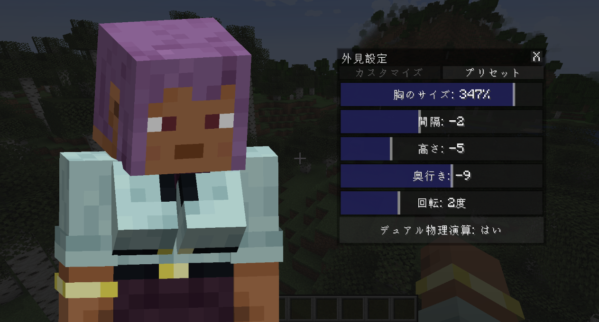
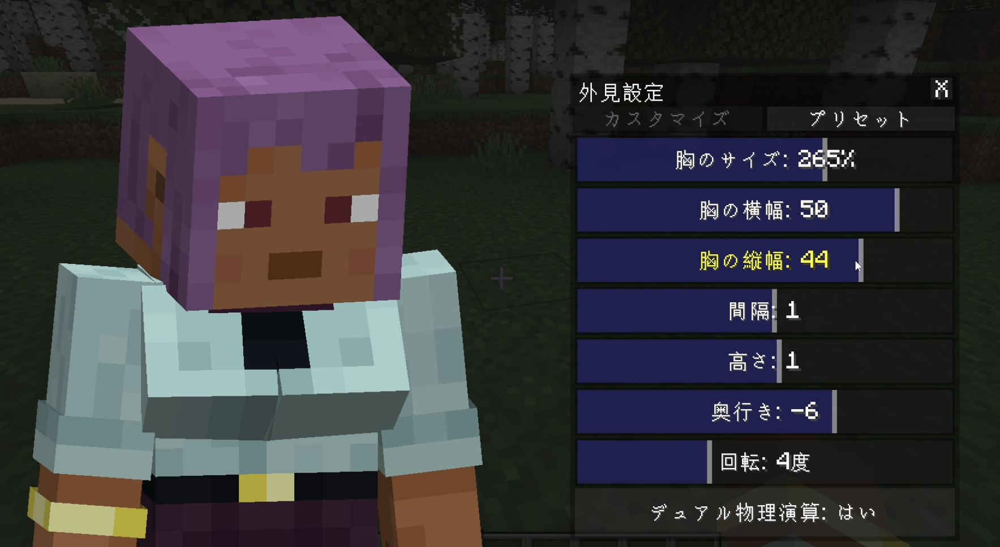
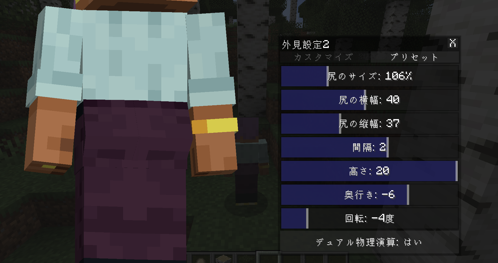
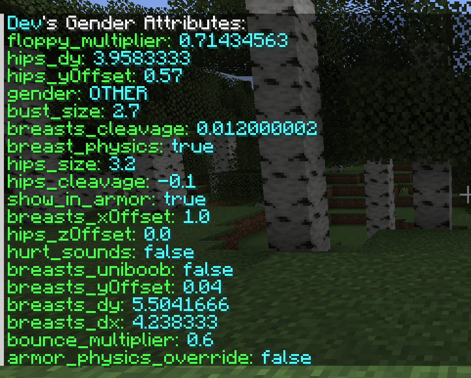

# Fork of Wildfire's Female Gender Mod

### Description
The mod's primary purpose is to add breasts to your Minecraft player to give it a more unique appearance than the generic model,
It works on client-side without issues but if you wish to add syncing support then this mod must be present on the server as well.

## Default Controls

G - Open Wildfire's Gender Menu

## Modifications
- 2025-03-03: (TACOWASA059) Change the range of settings available in config. Addition of Japanese ```ja-jp.json```. [ver3.0.2] 


- 2025-03-04: (TACOWASA059) Added breast height and width settings


- 2025-03-04: (TACOWASA059) Added hip settings


- 2025-03-05: (TACOWASA059) Added setting commands (ver3.0.4)


### commands for ver3.0.4
| command                                              | 説明                        | description                                            |
|------------------------------------------------------|---------------------------|--------------------------------------------------------|
| ```/gender <targets> ```                             | 指定したプレイヤーの現在のジェンダー設定を取得する | Get the current gender setting of the specified player |
| ```/gender <targets> <key> <value>```                | 指定したプレイヤーの特定のジェンダー設定を変更する | Change specific gender settings for a given player     |
| ```/gender <targetPlayer> copyFrom <sourcePlayer>``` | あるプレイヤーの設定を他のプレイヤーにコピーする  | Copying one player's settings to another               |

### keys
| key                     | type    | description      | range                  |
|-------------------------|---------|------------------|------------------------|
| bust_size	              | float   | 	バストサイズ          | 	0.0 ～ 3.2             |
| breasts_dx	             | float   | 	バストの横幅          | 	2.5 ～ 6.0             |
| breasts_dy	             | float   | 	バストの高さ          | 	2.5 ～ 6.0             |
| breasts_xOffset	        | float   | 	バストの X オフセット    | 	-1.0 ～ 1.0            |
| breasts_yOffset	        | float   | 	バストの Y オフセット    | 	-1.0 ～ 1.0            |
| breasts_zOffset	        | float   | 	バストの Z オフセット    | 	-2.0 ～ 0.0            |
| breasts_cleavage	       | float   | 	バストの角度          | 	-0.1 ～ 0.3            |
| hips_size	              | float   | 	ヒップサイズ          | 	0.0 ～ 3.2             |
| hips_dx	                | float   | 	ヒップの横幅          | 	2.5 ～ 6.0             |
| hips_dy	                | float   | 	ヒップの高さ          | 	2.5 ～ 6.0             |
| hips_xOffset	           | float   | 	ヒップの X オフセット    | 	-1.0 ～ 1.0            |
| hips_yOffset	           | float   | 	ヒップの Y オフセット    | 	-1.0 ～ 2.0            |
| hips_zOffset	           | float   | 	ヒップの Z オフセット    | 	-2.0 ～ 0.0            |
| hips_cleavage	          | float   | 	ヒップの角度          | 	-0.1 ～ 0.3            |
| bounce_multiplier	      | float   | 	揺れやすさ           | 	0.0 ～ 0.5             |
| floppy_multiplier	      | float   | 	慣性              | 	0.25 ～ 1.0            |
| breast_physics	         | boolean | 	物理演算            | 	true / false          |
| hurt_sounds	            | boolean | 	ダメージを受けた時の音     | 	true / false          |
| armor_physics_override	 | boolean | 	アーマー着用時の物理演算の適用 | 	true / false          |
| show_in_armor	          | boolean | 	アーマー越しの表示       | 	true / false          |
| breasts_uniboob	        | boolean | 	単一バスト           | 	true / false          |
| hips_uniboob	           | boolean | 	単一ヒップ           | 	true / false          |
| gender	                 | string  | 	プレイヤーの性別        | 	male / female / other |

## License

Wildfire's Female Gender Mod is licensed under GNU LGPLv3, a free and open-source license. For more information, please see the [license file](https://github.com/WildfireRomeo/WildfireFemaleGenderMod/blob/forge-1.19/LICENSE).

## Credits
- **Original Mod Author:** WildfireRomeo
- **Modifications by:** TACOWASA059 (2025)
